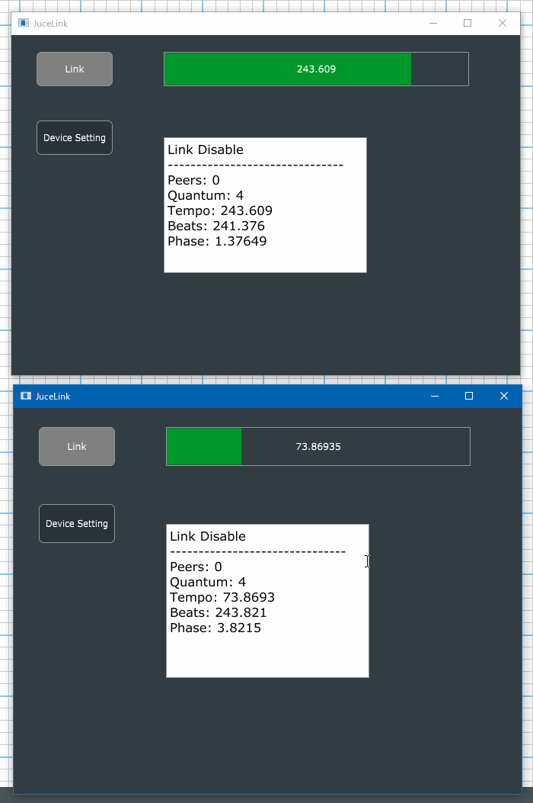

# juce_meets_link
An example of integration of Ableton Link and JUCE6 with CMake.

***DEMO:***

## Requirement
+ CMake 3.15 or later
+ Git

## How to build
+ Get Sources
~~~
$ git clone https://github.com/COx2/juce_meets_link.git
$ cd juce_meets_link
$ git submodule update --init --recursive
~~~

+ Generate project by CMake

Shortcut: For Visual Studio 2019 users
~~~
.\Scripts\build_vs2019.bat
~~~

Shortcut: For Xcode users
~~~
./Scripts/build_xcode.command
~~~

+ Build by IDE

## License
  GPL v3